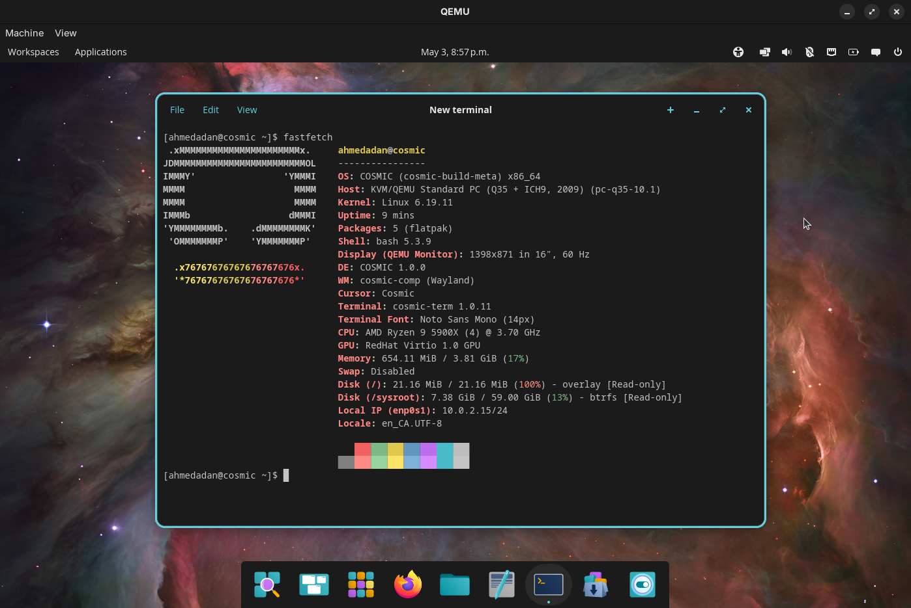

# cosmic-build-meta

The [COSMIC](https://github.com/pop-os/cosmic-epoch) desktop as a **bootc/OCI image** and **bootable Live ISO**, built with [BuildStream 2.x](https://buildstream.build/) on top of [freedesktop-sdk](https://freedesktop-sdk.io/). Boots end-to-end into `cosmic-initial-setup` in QEMU. Also consumable as a BuildStream **junction** by downstream OS-image projects.



## Status

- **109 local elements** (`elements/`), ~700 with freedesktop-sdk transitives. `just build` succeeds with 0 failures from a cold cache.
- **Two image variants**: `cosmic` (Mesa, default) and `cosmic-nvidia` (NVIDIA proprietary driver, kernel modules, EGL/GBM userspace, device-node and logind/udev glue). Same BST graph; only the top-level image stack differs.
- **Bootable image** (`bootable.raw`): boots into `cosmic-initial-setup` → `cosmic-greeter` → user session under QEMU + KVM + OVMF.
- **Live ISO**: UEFI-bootable GPT disk image with autologin to a `cosmic-live` user, autostarts [cosmonaut-installer](https://github.com/razorfinos-org/cosmonaut-installer) — a native libcosmic GUI driving a privileged DBus daemon that installs from the OCI image baked into the ISO (`oci:/usr/lib/bootc/install-source/main`) against an opinionated profile (btrfs + composefs + systemd-boot, optional LUKS).
- **CI**: GitHub Actions builds both variants weekly + on push to `main`, publishes to `ghcr.io/razorfinos-org/cosmic-build-meta:{cosmic,cosmic-nvidia}-{nightly,vX.Y.Z}` with keyless cosign signing and SLSA build-provenance attestations. ISOs are uploaded as workflow artifacts and (on tag pushes) attached to GitHub Releases.

**Known caveats**

- Dynamic VM resolution resize is broken pending [smithay PR #1923](https://github.com/Smithay/smithay/pull/1923) being picked up by cosmic-comp's pinned rev. We work around it by pinning a fixed mode via a default `outputs.ron` ([cosmic-epoch #1351](https://github.com/pop-os/cosmic-epoch/issues/1351)).
- No artifact cache stood up yet — cold builds take hours, mostly Rust compile time. CI uses `actions/cache` keyed on the BST cache directory; no public artifact server.
- Only x86_64 has been built end-to-end. aarch64 and riscv64 are wired in `project.conf` but untested.
- First-login per-user setup wizard is suppressed (settings configured in OEM mode don't carry over).
- Physical NVIDIA Live ISO performance/DRM handoff is still under active validation. Current images include the confirmed baseline fixes (NVIDIA userspace/device nodes, greetd PAM → logind session, debug tooling), but the remaining `cosmic-comp` KMS permission issue is being investigated separately.

## Quick start

**Requirements**

- [podman](https://podman.io/) (rootful)
- [just](https://github.com/casey/just)
- ~50 GB free disk space (image build); ~80 GB if you also build the Live ISO
- For `boot-vm` / `boot-iso`: `qemu-system-x86_64`, OVMF firmware, KVM enabled

### Bootable image (qemu-runnable raw disk)

```sh
just build                      # multi-hour cold build; loads OCI image into rootful podman
just generate-bootable-image    # `bootc install to-disk` into a 30 GB sparse raw file
just boot-vm                    # QEMU + KVM + OVMF, GTK display
```

For the NVIDIA variant, build and load the variant-specific image tag:

```sh
just build-variant cosmic-nvidia     # loads ghcr.io/razorfinos-org/cosmic-build-meta:nvidia-nightly locally
COSMIC_IMAGE_TAG=nvidia-nightly just generate-bootable-image
just boot-vm
```

`just build` is incremental — once warm, only changed elements rebuild.

### Live ISO (installer medium)

```sh
just build-iso                  # produces build/iso/cosmic-stable-amd64.iso
just boot-iso                   # boots the ISO with a sparse 60 GB virtio target attached as /dev/vdb
```

Pass `cosmic-nvidia` to either recipe to build / boot the NVIDIA variant.

The ISO artifact is really a **UEFI-bootable GPT disk image** with an `.iso` filename (FDSDK 25.08's systemd-repart predates `--el-torito`, so there's no ISO9660 boot catalog). Boot it as a virtio block device, not `-cdrom`; same image can be `dd`'d to a USB stick.

### Debugging the running VM / Live ISO

- `build/console.log` (VM) / `build/iso-console-<variant>.log` (ISO) — full kernel + systemd serial capture, also tee'd live during boot.
- `build/debug-shell.sock` (VM) / `build/iso-debug-shell-<variant>.sock` (ISO) — always-on root shell on serial1, reachable from another terminal:
  ```sh
  socat - UNIX-CONNECT:build/debug-shell.sock
  ```
  Useful when the graphical session is broken and the journal is the only way in.
- QEMU monitor: `Ctrl-A` then `C` in the `boot-vm` terminal, or `socat - UNIX-CONNECT:build/iso-qemu-<variant>.sock` for the ISO.
- `cosmic-debug-dump` is installed in both bootc images and both Live ISOs. From a debug shell, run `cosmic-debug-dump --upload` to capture logind/session state, DRM clients, NVIDIA userspace/device nodes, and relevant journals.

`just --list` shows every recipe.

## Customising

| Env var | Default | Effect |
|---|---|---|
| `BST_ARCH` | host arch | BST `arch` option, passed as `--option arch` to every `bst` invocation. |
| `BST2_IMAGE` | pinned `bst2:8fe67f04…` | Container image used to run BST. Pinned by SHA for reproducibility; bump when upstream rolls a new tag. |
| `COSMIC_VM_MEMORY` | `4G` | RAM passed to QEMU (`boot-vm` only; `boot-iso` is hard-coded to 32 GB to fit the live env's tmpfs root). |
| `COSMIC_VM_CPUS` | `4` | vCPU count for `boot-vm`. |
| `COSMIC_VM_XRES` / `COSMIC_VM_YRES` | `1680` / `1050` | Initial guest resolution. Must agree with `files/oci/cosmic-defaults/outputs.ron` — the Justfile vars only affect QEMU, not cosmic-comp's mode pick. |
| `COSMIC_OVMF_CODE` / `COSMIC_OVMF_VARS` | `/usr/share/edk2/ovmf/OVMF_{CODE,VARS}.fd` | OVMF firmware paths. Override on Debian (`/usr/share/OVMF/…`) or Arch (`/usr/share/edk2-ovmf/x64/…`). |
| `COSMIC_FILESYSTEM` | `btrfs` | Root filesystem for the bootable image (`btrfs` / `xfs` / `ext4`). |
| `COSMIC_IMAGE_NAME` | `ghcr.io/razorfinos-org/cosmic-build-meta` | Local podman tag namespace for `just bootc` and `just generate-bootable-image`. Matches the `org.opencontainers.image.ref.name` annotation so `bootc upgrade` resolves the same ref post-install. |
| `COSMIC_IMAGE_TAG` | `nightly` | Local image tag. `just build` loads `:nightly`; `just build-variant cosmic-nvidia` turns the unqualified default into `:nvidia-nightly`. If the value is already variant-prefixed (`nvidia-*` or `cosmic-nvidia-*`), it is preserved. CI uses full registry tags (`cosmic-nightly`, `cosmic-nvidia-nightly`, …). |
| `COSMIC_BOOTABLE_IMAGE` | `build/bootable.raw` | Path of the sparse raw disk image. |
| `COSMIC_BOOTABLE_SIZE` | `30G` | Size of the sparse fallocate. |
| `COSMIC_INSTALL_TARGET` | `build/install-target.raw` | Sparse target disk attached as `/dev/vdb` to `boot-iso` so cosmonaut-installer has somewhere to install onto. |
| `COSMIC_INSTALL_TARGET_SIZE` | `60G` | Sparse size of the install target. |
| `COSMIC_TPM` | unset | Set to `1` on `boot-iso` / `boot-iso-headless` to attach an emulated TPM2 via `swtpm`. State persists in `build/swtpm-state-<variant>/` across boots so TPM2-LUKS unseal works on reboot. Requires `swtpm` on the host. Use to test cosmonaut-installer's TPM2-LUKS install variants. |

## Using as a junction

Downstream OS-image projects can consume cosmic-build-meta as a BuildStream junction.

**`elements/cosmic-build-meta.bst`** — declare the junction:

```yaml
kind: junction

sources:
- kind: git_repo
  url: github:RazorfinOS-org/cosmic-build-meta.git
  track: main
  ref: <commit-ref>

config:
  # Pin our freedesktop-sdk junction to the one cosmic-build-meta uses,
  # so the build graph doesn't end up with two divergent FDSDK copies.
  overrides:
    freedesktop-sdk.bst: cosmic-build-meta.bst:freedesktop-sdk.bst
```

**Depend on a public stack**:

```yaml
# Full desktop with all apps
depends:
  - cosmic-build-meta.bst:core/public-stacks/cosmic-full.bst

# Or just the session, no apps
depends:
  - cosmic-build-meta.bst:core/public-stacks/cosmic-session.bst

# Or cherry-pick individual components
depends:
  - cosmic-build-meta.bst:core/cosmic-comp.bst
  - cosmic-build-meta.bst:core/cosmic-panel.bst
```

**Public stacks**:

| Stack | Contents |
|---|---|
| `core/public-stacks/cosmic-session.bst` | Compositor, session, shell, greeter, icons, wallpapers |
| `core/public-stacks/cosmic-apps.bst` | Files, Edit, Terminal, Store, Settings, Player, Notifications, OSD |
| `core/public-stacks/cosmic-full.bst` | Session + apps |

If you need cargo2-vendored elements (every `core/cosmic-*` is one), register the `cargo2` source plugin in your downstream `project.conf` the same way `cosmic-build-meta` does. If you only consume the pre-built `oci/cosmic/image.bst` artifact, you can skip that.

The `installer/cosmic-images-json.bst` element exists specifically so downstream consumers can override the cosmonaut-installer image picker without touching anything else under `installer/` — re-define the element in your project to ship your own catalog and `default_image`.

## Project layout

```
elements/
  freedesktop-sdk.bst            Junction to FDSDK 25.08
  core/                          COSMIC binaries (compositor, shell, apps, greeter)
  core-deps/                     Build deps not in FDSDK (greetd, just, libdisplay-info, oniguruma, …)
  cosmic-deps/                   Runtime system stack (base, fonts, networking, audio, bootc, …)
  cosmic-deps-nvidia/            NVIDIA driver stack (nvidia.ko build, userspace, EGL-Wayland, modprobe glue)
  installer/                     Live ISO assembly: live-image (systemd-repart), live-extras (autologin / live-only
                                 polkit), cosmonaut-installer (libcosmic GUI + DBus daemon), images.json catalog
  oci/                           Bootc/OCI image assembly chain
    cosmic/                      Default Mesa image (stack, filesystem, image, init-scripts)
    cosmic-nvidia/               NVIDIA variant image
    cosmic-live/                 Composed Live env root (cosmic stack + installer drop-ins)
    cosmic-nvidia-live/          Composed Live env root for the NVIDIA variant
    integration/                 Branding, presets, bootc config, tuning drop-ins
  plugins/                       Junctions for buildstream-plugins{,-community}
files/
  initramfs/                     Vendored generate-initramfs script tree + module set
  installer/                     Live env drop-ins: greetd autologin, networkd, sysusers, repart partitions, images.json
  oci/                           Branding, presets, greetd config + kiosk wrappers, tmpfiles, sysusers, tuning
plugins/
  local/sources/cargo2.py        cargo2 plugin with git-submodule support
  local/elements/collect_initial_scripts.py
                                 Vendored from FDSDK (MIT, attribution preserved)
include/
  aliases.yml                    URL aliases (github / github-media / github-raw / crates / pypi / …)
  live-image-common.yml          Shared Live ISO sysroot-prep/repart scaffolding for both variants
project.conf                     BST config: RUSTFLAGS, plugin registrations, manual element env
Justfile                         Podman wrapper for bst commands + image / ISO / VM lifecycle recipes
.github/workflows/               Matrix build (cosmic + cosmic-nvidia), GHCR push, cosign signing
docs/images/                     README screenshots
```

## Architecture notes

**Rust components**. Every `core/cosmic-*.bst` is `kind: manual` running `just build-release` and `just install` from the upstream COSMIC repo. Cargo dependencies are vendored offline via `kind: cargo2` source — our local fork of `cargo2.py` adds git-submodule support that upstream doesn't have.

**Bootc/OCI image**. `elements/oci/cosmic/{stack,filesystem,image,init-scripts}.bst` mirrors the `oci/gnomeos/` shape from gnome-build-meta. The final assembly squashes layers with `podman build --squash-all` (see `just load-image`) to work around bootc 1.15's splitstream EOF on multi-layer images.

**NVIDIA variant**. `oci/cosmic-nvidia/stack.bst` depends on the full default stack and adds `cosmic-deps-nvidia/deps.bst`. The integration commands re-run `depmod` against the composed root so the NVIDIA modules (`nvidia`, `nvidia-modeset`, `nvidia-drm`, `nvidia-uvm`) join the in-tree module dep graph. nouveau is blacklisted; `nvidia-drm.modeset=1` and `fbdev=1` are set; NVIDIA PCI/DRM devices get Pop/Fedora-style `seat` / `master-of-seat` udev tags; `nvidia-modprobe` and a fallback systemd service create `/dev/nvidia*` auxiliary nodes.

**Live ISO**. `installer/live-image-<variant>.bst` is a `kind: script` element wrapping `systemd-repart --offline` against `oci/<variant>-live/filesystem.bst` (the live env EROFS root). Both variants share `include/live-image-common.yml` for `/usr/etc` merging, sysusers/shadow synthesis, `depmod`, setuid restoration, and greetd wiring. The `.iso` artifact is a GPT disk image — there's no ISO9660 boot catalog because FDSDK 25.08's systemd-repart predates `--el-torito`. UEFI boots it as a normal disk via the ESP and chainloads `BOOTX64.EFI`.

**cosmonaut-installer wiring**. The Live env autologins as `cosmic-live`, autostarts [cosmonaut-installer](https://github.com/razorfinos-org/cosmonaut-installer) — a native libcosmic GUI that drives a privileged DBus daemon (`dev.cosmonaut.Installer1`) running as root. The daemon owns a Rust install engine that runs `bootc install to-filesystem` against an opinionated profile (btrfs + composefs + systemd-boot, optional LUKS via cryptsetup / TPM2). GUI never has root; polkit guards the privileged DBus methods, with a live-only allow-rule (`installer/live-extras.bst`) granting passwordless access to the `cosmic-live` user. The picker reads its catalog from `/etc/cosmonaut-installer/images.json` (`installer/cosmic-images-json.bst`) — a single-image catalog, so the picker self-skips and the user goes welcome → disk picker. Each Live ISO bakes its matching bootc OCI layout into `/usr/lib/bootc/install-source/main`; installs use `oci:/usr/lib/bootc/install-source/main` and work offline. Run `bootc upgrade` after install to move onto the published registry stream.

**LFS overlays**. cosmic-wallpapers, cosmic-greeter, and cosmic-initial-setup ship media via Git LFS. We disable LFS smudge globally inside the BuildStream container (cargo2 vendoring otherwise breaks on synthetic crate trees), so each LFS-tracked file is layered back in via a `kind: remote` source pointing at `media.githubusercontent.com/media/…` — the `github-media:` URL alias. The `ref:` for each `kind: remote` is the LFS oid sha256, which equals the SHA256 of the file content — exactly what BST expects.

## Known build workarounds

| Component / area | Workaround | Reason |
|---|---|---|
| All Rust elements | `RUSTFLAGS="-C link-arg=-fuse-ld=lld"` in `project.conf` | FDSDK sandbox requires lld |
| All `kind: manual` | Centralised `PKG_CONFIG_PATH` in `project.conf` `elements.manual.environment` | Sandbox doesn't set it by default |
| All `kind: manual` Rust | `gcc-base.bst` + `binutils.bst` build-deps | Need `crtbeginS.o` and an assembler |
| cargo2 plugin | Local fork (`plugins/local/sources/cargo2.py`) with submodule support | Upstream cargo2 doesn't fetch git submodules |
| cargo2 vendoring | LFS smudge disabled globally in `Justfile` | LFS smudge filter breaks crate-tree fetches with HangupException |
| LFS-backed media (wallpapers, greeter background, theme thumbnails, layout icons, cities database) | `kind: remote` overlay per file from `github-media:…` | Otherwise pointer files ship instead of real blobs |
| cosmic-comp / cosmic-session / cosmic-settings-daemon / cosmic-workspaces-epoch / xdg-desktop-portal-cosmic | `kind: manual` not `kind: make` | Upstream Makefiles expect `vendor.tar` from `VENDOR=1`, doesn't exist with cargo2 vendoring |
| All Rust builds | `cargo build --release --offline --frozen` (not `--locked`) | `--locked` rejects sandboxed/vendored builds |
| Double-slash URLs | `bst source track` with refreshed Cargo.lock | cargo2 `translate_url()` normalises `pop-os//cosmic-protocols` to single slash; refresh restores the doubled form |
| greetd | `sed` patch enabling nix's `feature` cargo feature on agreety | Vendored nix 0.28 default features don't resolve offline; agreety uses `utsname` gated on that feature |
| greetd | URL must not have `.git` suffix inside container | sr.ht git-fetch quirk |
| cosmic-greeter | `VERGEN_IDEMPOTENT=true` + `libinput.bst` in `depends` | vergen build script needs git; linker needs `-linput` |
| cosmic-edit | `RUSTONIG_SYSTEM_LIBONIG=1` + `oniguruma.bst` build-dep | Use system oniguruma instead of bundled git submodule |
| Sandbox tooling | `findutils.bst`, `sed.bst`, `make.bst` added per-element as needed | FDSDK runtime image is minimal |
| Bootc image | `podman build --squash-all` after `bst artifact checkout` | bootc 1.15 splitstream EOF on multi-layer images |
| Live ISO setuid bits | Explicit `chmod 4755` on `pkexec`/`sudo`/`su`/etc. in `include/live-image-common.yml` | BST's compose step strips setuid; the bootc image dodges via fakecap+build-oci, the live env packs straight to EROFS without it |
| Live ISO `/etc/shadow` | Synthesise from `/etc/passwd` at image-build time in `include/live-image-common.yml` | FDSDK sysusers leaves `/etc/shadow` empty; without entries, PAM AUTHINFO_UNAVAIL kills greetd |
| QEMU display | `files/oci/cosmic-defaults/outputs.ron` preset pinning Virtual-1 to 1680×1050 + tmpfiles `C` copy into `~cosmic-{initial-setup,greeter}/.local/state/cosmic-comp/` | smithay PR #1923 unmerged in cosmic-comp; without it the compositor ignores virtio-gpu hot-plug mode changes |
| First-login wizard re-run | Empty `/etc/skel/.config/cosmic-initial-setup-done` | accountsservice → useradd -m honours `/etc/skel`; the marker makes the autostart exit immediately |
| Quiet boot | `quiet loglevel=3 systemd.show_status=false rd.udev.log_level=3 vt.global_cursor_default=0` kargs + drop `console=tty0` | Avoid kernel/systemd scroll competing with cosmic-comp on the GTK display |
| `bst source track` re-tag wart | Manual describe-string bump after auto-PR | When upstream re-tags an unchanged commit, BST short-circuits because the commit hash didn't change — leaves the older `epoch-X.Y.Z` describe string |

## Supported architectures

- **x86_64** — primary; both image variants build and boot end-to-end, both Live ISOs build and boot in QEMU.
- **aarch64** — wired in `project.conf` `go-arch`, experimental still under development
- **riscv64** — experimental, wired, experimental still under development

## CI & releases

`.github/workflows/build.yml` builds both variants in a matrix on every push to `main`, weekly on Monday 08:00 UTC, and on `v*` tags. PRs build only when authored by the `auto/track-*` source-bump bot or labelled `build` (saves runner minutes). Each successful run publishes:

- **OCI image** to `ghcr.io/razorfinos-org/cosmic-build-meta:<variant>-{nightly,vX.Y.Z}` (and `<variant>-pr-N` for PR builds), squashed with `podman build --squash-all`.
- **Cosign signature** + certificate (keyless, OIDC-bound). Verify with:
  ```sh
  cosign verify ghcr.io/razorfinos-org/cosmic-build-meta:cosmic-nightly \
      --certificate-identity-regexp='https://github.com/razorfinos-org/cosmic-build-meta/.*' \
      --certificate-oidc-issuer='https://token.actions.githubusercontent.com'
  ```
- **SLSA build-provenance** attestation (Sigstore), verifiable via `cosign verify-attestation`.
- **Live ISO** as a workflow artifact (and a GitHub Release asset on tag pushes), with `.sha256`, `.sig`, `.cert` sidecars from `cosign sign-blob`.

The BST cache is shared across runs via `actions/cache`, keyed on `runner.arch` × variant × `run_id` with a per-variant fallback prefix.

## Credits

The bootc/OCI pipeline is heavily inspired by [gnome-build-meta](https://gitlab.gnome.org/GNOME/gnome-build-meta). The `elements/oci/` directory layout, `files/initramfs/generate-initramfs` script tree, and `plugins/local/elements/collect_initial_scripts.py` were vendored from there with attribution preserved in their source files.

The cargo2 source plugin is forked from [buildstream-plugins-community](https://gitlab.com/buildstream/buildstream-plugins-community) with git-submodule support added locally.

[cosmonaut-installer](https://github.com/razorfinos-org/cosmonaut-installer) provides the Live ISO's installer GUI: a libcosmic frontend driving a privileged Rust install engine over DBus. The engine's `bootc install to-filesystem` invocation is patterned on [tuna-os/fisherman](https://github.com/tuna-os/fisherman) (which we used via the tuna-installer Flatpak before — credit there for the recipe shape).
